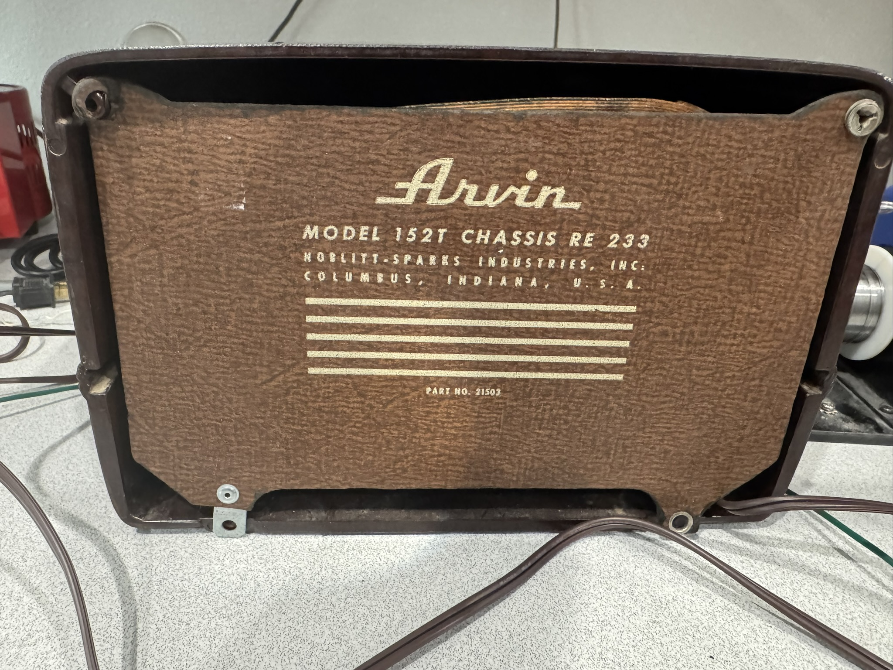
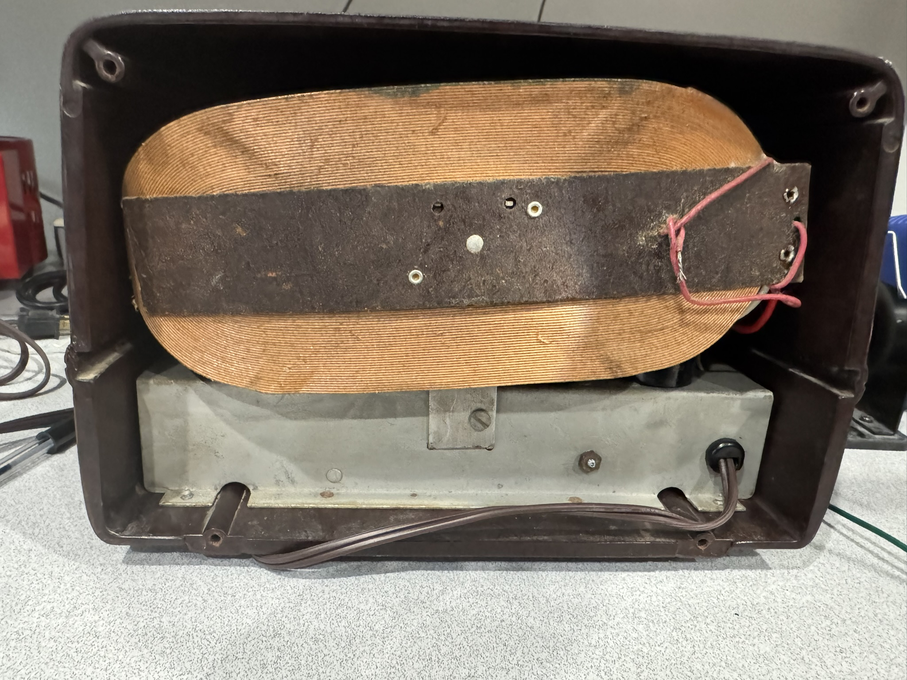
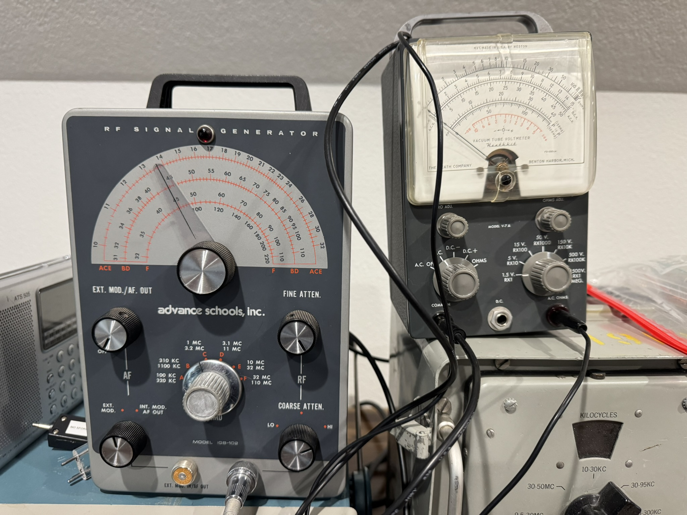
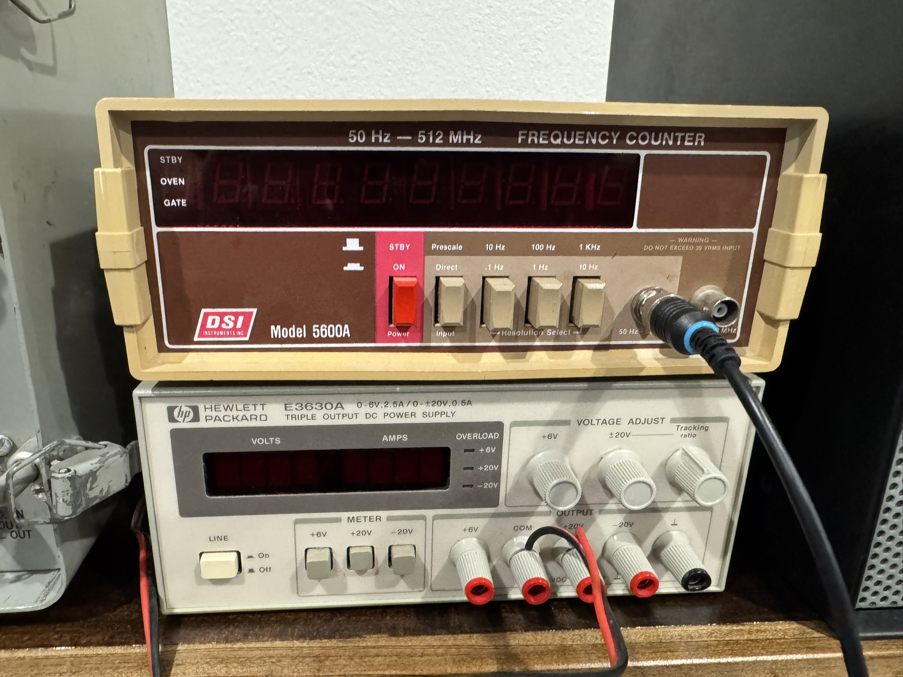
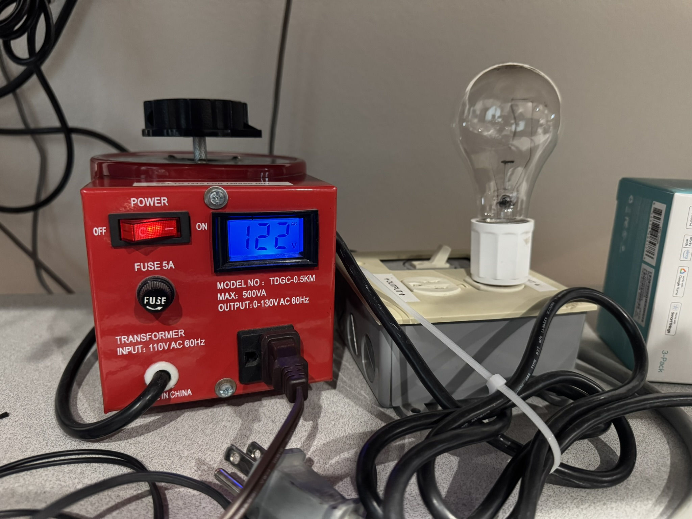
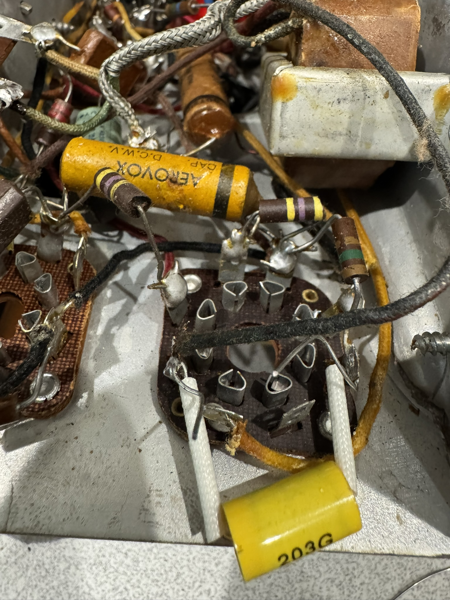
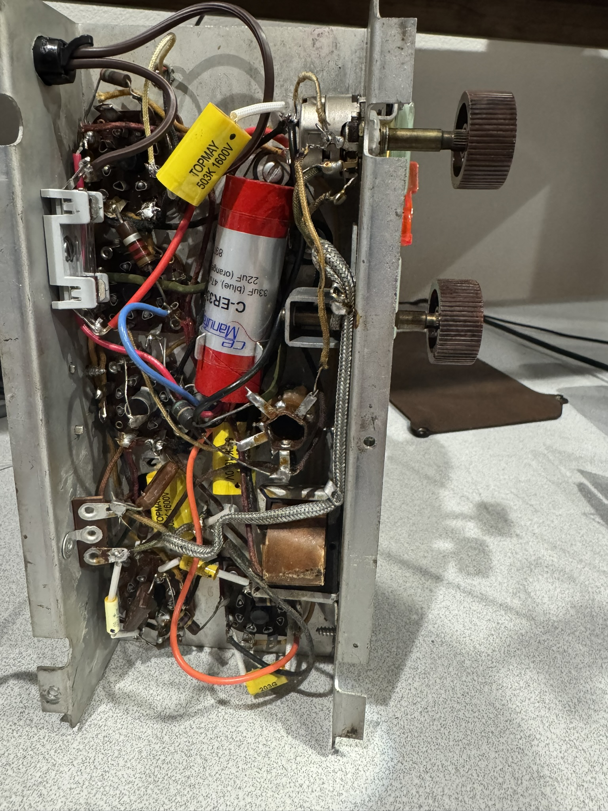

<!-- You can also write down presenter notes in HTML comments. -->
# Restoring an Arvin 152T Radio

---
<!-- backgroundColor: beige -->

### Arvin 152T
- AM Broadcast Band desktop mediumwave radio
- Purchased at estate sale for $9
- AC/DC transformer-less design
- **Date Manufactured:** 1948, post-WW2
- **Manufacturer:** Noblitt-Sparks Industries, Columbus, Indiana
- **Circuit:** All American 5 (AA5) superheterodyne design
- **Tube Compliment:** 35Z5GT, 12SA7, 12SK7, 12SQ7, 50L6GT

---

### Tools Used

- Variac
- Dim bulb current limiter
- Heathkit IGB-102 RF signal generator
- DSI 5600A Frequency Counter
- Heathkit V-7A Vaccum Tube Volt Meter (VTVM)
- Military TV-7/U tube tester
- DeOxit D5 & DeOxit Fader Lube

---

### Initial Evaluation

- Inspect chassis, tubes, components, circuit
- Power on slowly using current limiting variac/isolation transformer (Increase 20 volts every 15 minutes)
- Initial power was successful.  Was able to receive only one radio signal.  WHO 1040 but audio garbled
- Excessive hum in the audio indicate bad filter capacitors.  Confirmed by clipping in a test cap in parallel with filter cap
- Brittle power cord, wires to lamp and antena loop

---

### Restoration Steps

- Replaced electrolytic and paper wax capacitors
- Replaced AC power to use polarized cord, fuse and switch on hot lead (safety)
- Tested vacuum tubes and replace with New Old Stock (NOS) tubes
- Cleaned tube sockets and volume control with DeOxit
- Cleaned chassis and cleaned/polished knobs and case
- Replaced brittle rubber insulators on air-variable capacitor and brittle insulation
- Tested voltages listed in schematic (117V B+, 90V plate & grids, 5V bias)
- Tested and replaced out of spec resistors
- Performed alignment process

---

### Results

- Can now receive 20+ stations
  - **KWTO 560**, Springfield MO
  - **WSM 650**, Nashville, TN
  - **KRLD 1080**,  Dallas TX
  - **KOTV 1170**, Tulsa OK
- No AC hum in audio
- Updated to current safety standards 

---
### Demo

[Click here for demo of the restored Arvin 152T Radio](https://youtu.be/yTvxM2lwgEU?si=NDE4axC8LdE2N_x7)

---
### Schematic

---
